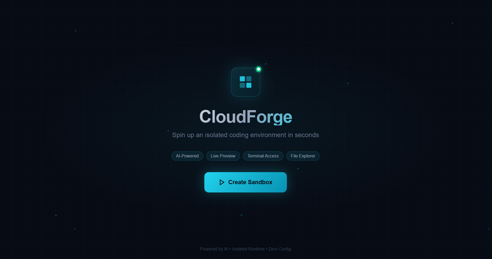
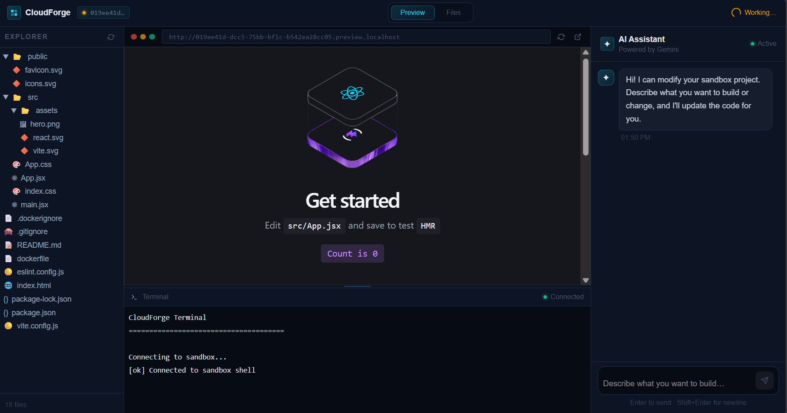
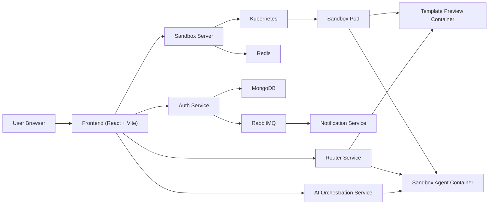

# CloudForge

<p align="center">
  <strong>AI-powered isolated coding environments in seconds.</strong><br />
  Spin up disposable developer sandboxes with live preview, terminal access, file browsing, and an integrated AI coding assistant.
</p>

<p align="center">
  <a href="#"></a>
  <a href="#"></a>
  <a href="#"></a>
  <a href="#"></a>
  <a href="#"></a>
  <a href="#"></a>
</p>

<p align="center">
  <a href="#quick-start"><strong>Get Started</strong></a>
  ·
  <a href="#how-it-works"><strong>Architecture</strong></a>
  ·
  <a href="#api-documentation"><strong>API</strong></a>
  ·
  <a href="#contributing"><strong>Contribute</strong></a>
</p>

> CloudForge is a microservice-based cloud development platform that creates ephemeral coding environments on demand, routes traffic to isolated previews, exposes live terminal and file APIs, and layers an AI assistant on top to help users build faster.

## Why CloudForge?

Modern developer tools should be instant, safe, collaborative, and programmable.

CloudForge is built around that idea:

- create a fresh coding environment on demand
- isolate each workspace from the rest of the system
- expose preview, terminal, and file APIs through a browser IDE
- let AI operate directly inside the sandboxed workspace
- clean up automatically when the sandbox expires

If this project is useful, consider giving it a star and using it as the foundation for your own AI-native developer platform.

## Features

| Feature | Description |
| --- | --- |
| `🚀` Instant sandbox provisioning | Create isolated coding environments in seconds using Kubernetes-backed runtime pods. |
| `🧠` AI coding assistant | Stream AI-assisted edits into the active sandbox using the orchestration service. |
| `🖥️` Live preview | Open the running app inside the IDE through sandbox-specific preview routes. |
| `📁` File explorer | Browse and inspect sandbox files directly from the web UI. |
| `⌨️` Terminal access | Connect to a live PTY-backed terminal inside the sandbox via Socket.IO. |
| `🔐` Auth-ready architecture | Supports Google OAuth, JWT cookies, and project ownership flows. |
| `♻️` Auto-cleanup | Redis-backed TTLs expire inactive sandboxes and remove cluster resources automatically. |
| `🧩` Microservice-friendly | Frontend, auth, AI, sandbox orchestration, router, and notification services are cleanly separated. |
| `☁️` Kubernetes-native | Designed to run with ingress, dynamic routing, service discovery, and per-sandbox infrastructure. |

## Tech Stack

### Application Stack

| Layer | Technologies |
| --- | --- |
| Frontend | React 19, Vite 8, Tailwind CSS 4, XTerm.js, Socket.IO Client |
| API Services | Node.js, Express 5, Morgan, Cookie Parser, CORS |
| Authentication | Passport, Google OAuth 2.0, JWT, Mongoose |
| Sandbox Runtime | Kubernetes, dynamic Pods and Services, Node PTY, Socket.IO |
| Persistence | MongoDB, Redis |
| Messaging | RabbitMQ, Nodemailer |
| AI | LangChain, LangGraph, Mistral integration, Zod |
| DevOps | Docker, Skaffold, NGINX Ingress |

### Stack Badges

<p>
  
  
  
  
  
  
  
  
  
  
</p>

## Demo / Screenshots

### Product Walkthrough

.gif)

### Screenshots





### Suggested Demo Flow

1. Open the landing page
2. Click `Create Sandbox`
3. Wait for sandbox initialization
4. Explore files, preview, and terminal
5. Ask the AI assistant to modify the app
6. Watch the preview update live

## Quick Start

### Prerequisites

Make sure the following are available:

- Node.js 20+
- npm
- Docker
- Kubernetes cluster
- NGINX ingress controller
- MongoDB
- Redis
- RabbitMQ
- Skaffold

### 1. Clone the Repository

```bash
git clone https://github.com/your-org/sandbox-ide.git
cd sandbox-ide
```

### 2. Install Dependencies

Install dependencies for each service:

```bash
cd frontend && npm install
cd ../auth && npm install
cd ../ai-orchestration && npm install
cd ../notification && npm install
cd ../sandbox/server && npm install
cd ../sandbox/router && npm install
cd ../sandbox/agent && npm install
cd ../sandbox/template && npm install
```

### 3. Configure Environment Variables

Create `.env` files for the relevant services using the examples in the [Environment Variables](#environment-variables) section.

### 4. Start the Platform

For Kubernetes-based development:

```bash
skaffold dev
```

Start the frontend separately:

```bash
cd frontend
npm run dev
```

### 5. Open the App

```text
http://localhost:5173
```

## How It Works

CloudForge uses a microservice architecture with dynamic sandbox provisioning.

### High-Level Flow

1. The frontend sends a request to create a sandbox.
2. The sandbox control service creates:
   - a Kubernetes pod for the runtime
   - a Kubernetes service for networking
   - a Redis TTL key for lifecycle management
3. The pod starts multiple containers, including:
   - a preview app container
   - a sandbox agent container
   - a sync-related sidecar
4. The router forwards wildcard sandbox requests:
   - `*.preview.localhost` to the preview container
   - `*.agent.localhost` to the agent container
5. The frontend connects to:
   - preview via iframe
   - files via agent-backed API routes
   - terminal via Socket.IO
6. The AI orchestration service reads and updates files in the sandbox using agent APIs.
7. Redis expiration eventually triggers cleanup of the sandbox resources.

### Architecture Diagram



## API Documentation

Below are the main API surfaces exposed by the platform today.

### Sandbox API

Base path:

```text
/api/sandbox
```

| Method | Endpoint | Description |
| --- | --- | --- |
| `POST` | `/api/sandbox/start` | Create a new sandbox. Can bootstrap a guest session or a saved project flow. |
| `POST` | `/api/sandbox/project` | Create a project for an authenticated user. |
| `GET` | `/api/sandbox/project` | List authenticated user projects. |
| `GET` | `/api/sandbox/health` | Health check for the sandbox API. |
| `GET` | `/api/sandbox/:sandboxId/status` | Check runtime readiness for the sandbox. |
| `GET` | `/api/sandbox/:sandboxId/files` | List files from the sandbox agent. |
| `GET` | `/api/sandbox/:sandboxId/files/content?file=...` | Read a file from the sandbox. |

### Example: Start a Sandbox

```http
POST /api/sandbox/start
Content-Type: application/json
```

```json
{
  "title": "Untitled Project"
}
```

Example response:

```json
{
  "message": "Sandbox environment created successfully",
  "sandboxId": "019ee3fb-5b1a-701b-a95a-941572e6bba1",
  "projectId": "019ee3fb-5b1a-701b-a95a-941572e6bba1",
  "previewUrl": "http://019ee3fb-5b1a-701b-a95a-941572e6bba1.preview.localhost",
  "isGuestSession": true
}
```

### AI API

Base path:

```text
/api/ai
```

| Method | Endpoint | Description |
| --- | --- | --- |
| `POST` | `/api/ai/invoke` | Stream AI-assisted coding actions into the sandbox. |

### Auth API

Base path:

```text
/api/auth
```

| Method | Endpoint | Description |
| --- | --- | --- |
| `GET` | `/api/auth/google` | Start Google OAuth login |
| `GET` | `/api/auth/google/callback` | OAuth callback and JWT cookie issuance |

## Project Structure

```text
CloudForge/
├── frontend/                # React web application
├── auth/                    # Authentication service (Google OAuth + JWT)
├── ai-orchestration/        # AI service for file-aware coding workflows
├── notification/            # Notification and email service
├── sandbox/
│   ├── server/              # Sandbox control plane and lifecycle API
│   ├── router/              # Wildcard preview/agent traffic router
│   ├── agent/               # Per-sandbox file + terminal runtime agent
│   └── template/            # Default React/Vite starter sandbox project
├── k8s/                     # Kubernetes deployments, services, ingress, RBAC
├── skaffold.yml             # Kubernetes development workflow
└── README.md
```

## Environment Variables

This project uses multiple services, each with its own environment needs.

### Example `.env`

Use these as starting points and split them by service as needed.

```env
# Shared infrastructure
MONGO_URI=mongodb://localhost:27017/sandbox-ide
REDIS_URL=redis://localhost:6379
RABBITMQ_URL=amqp://localhost:5672

# Auth
JWT_SECRET=replace-with-a-strong-secret
GOOGLE_CLIENT_ID=your-google-client-id
GOOGLE_CLIENT_SECRET=your-google-client-secret
GOOGLE_REFRESH_TOKEN=your-google-refresh-token

# AI
MISTRAL_API_KEY=your-mistral-api-key

# Optional service settings
PORT=3000
NODE_ENV=development
```

### Recommended Service-Level Env Files

| Service | Typical Variables |
| --- | --- |
| `auth` | `MONGO_URI`, `JWT_SECRET`, `GOOGLE_CLIENT_ID`, `GOOGLE_CLIENT_SECRET`, `RABBITMQ_URL` |
| `sandbox/server` | `MONGO_URI`, `REDIS_URL`, `JWT_SECRET`, `PORT` |
| `sandbox/router` | `REDIS_URL`, `PORT` |
| `notification` | `RABBITMQ_URL`, `GOOGLE_CLIENT_ID`, `GOOGLE_CLIENT_SECRET`, `GOOGLE_REFRESH_TOKEN` |
| `ai-orchestration` | `MISTRAL_API_KEY`, `PORT` |

## Development Setup

This project is easiest to run in a Kubernetes-first local development workflow.

### Option A: Recommended Kubernetes Workflow

1. Start your local Kubernetes cluster
2. Ensure ingress is installed and working
3. Provision MongoDB, Redis, and RabbitMQ
4. Add required secrets for JWT, Google OAuth, AI provider credentials, and infra URLs
5. Start the backend platform:

```bash
skaffold dev
```

6. Run the frontend:

```bash
cd frontend
npm run dev
```

### Option B: Service-by-Service Development

Run each service individually in a separate terminal:

```bash
cd auth && npm run dev
cd ai-orchestration && npm run dev
cd notification && npm run dev
cd sandbox/server && npm run dev
cd sandbox/router && npm run dev
cd sandbox/agent && npm run dev
cd frontend && npm run dev
```

### Local Development Tips

- Start infrastructure dependencies before application services
- Verify Redis and RabbitMQ are reachable before testing lifecycle flows
- Confirm wildcard sandbox hostnames resolve correctly in your local ingress setup
- Use the sandbox health and status endpoints to debug initialization issues
- Keep the frontend and cluster routing ports aligned with your Vite proxy config

### Common Troubleshooting Areas

| Issue | Likely Cause |
| --- | --- |
| Sandbox hangs on startup | Pod readiness, preview startup, ingress routing, or Redis connectivity |
| Terminal disconnected | Agent container not ready, Socket.IO route mismatch, or wildcard host issue |
| Files not loading | Agent container unavailable or `/list-files` proxy path failing |
| Auth fails | Missing Google OAuth credentials or JWT secret mismatch |
| Auto cleanup not working | Redis unavailable or TTL refresh not occurring in router |

## Contributing

Contributions are welcome and appreciated.

### Ways to Contribute

- improve the platform architecture
- harden sandbox lifecycle handling
- enhance the frontend UX
- expand auth and project persistence flows
- improve documentation and setup ergonomics
- add tests, observability, and deployment tooling

### Contribution Workflow

1. Fork the repository
2. Create a feature branch
3. Make focused, well-documented changes
4. Add or update tests where appropriate
5. Open a pull request with a clear description

### Engineering Expectations

- prefer small, reviewable pull requests
- document user-facing behavior changes
- preserve service boundaries
- keep infrastructure changes explicit
- avoid coupling sandbox runtime assumptions too tightly to the frontend

### Suggested Commit Style

```text
feat: add sandbox readiness endpoint
fix: improve terminal reconnect behavior
docs: expand local development guide
```

## Roadmap

- [ ] Add first-class project persistence and restore flows
- [ ] Introduce stronger sandbox readiness probes
- [ ] Add full automated integration tests across services
- [ ] Support multiple sandbox templates and languages
- [ ] Improve observability with metrics, tracing, and structured logs
- [ ] Add role-based access and team collaboration features
- [ ] Support resumable sandboxes and snapshotting
- [ ] Add production-grade deployment docs
- [ ] Provide hosted demo and polished walkthrough GIFs
- [ ] Expand API reference and SDK options

## License

This project is available under the **MIT License**.

If you adopt a different license, update this section and add a `LICENSE` file at the repository root.

## Author / Acknowledgments

Built for developers who want the speed of local development with the safety and flexibility of cloud-isolated environments.

### Acknowledgments

- the React and Vite ecosystems
- the Kubernetes and ingress communities
- the LangChain and agent tooling ecosystem
- the open-source maintainers behind Socket.IO, Redis, MongoDB, RabbitMQ, and Express

---

<p align="center">
  <strong>CloudForge</strong><br />
  Build faster. Isolate safely. Let AI do more of the heavy lifting.
</p>

<p align="center">
  <a href="#quick-start">Try it now</a>
  ·
  <a href="#contributing">Contribute</a>
  ·
  <a href="#">Star the repo</a>
</p>
